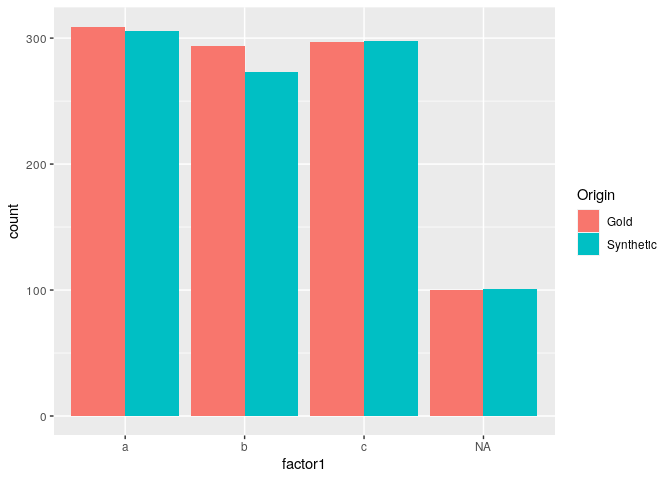

BigSyn
======

The 'BigSyn' package allows to synthetise a hierarchical database. All datasets are transposed in a wide format so that they all contain one row per unique identifier, where the identifier is common to all the datasets to synthetise, without being necessarily a primary key of each. The wide formats tables are merged by this identifier, then synthetised. The last step is the back transposition of the synthetised merged transposed

Installation
------------

To install with devtools, just run in R:

`devtools::install_github("DanielBonnery/BigSyn")`

Package dependencies
--------------------

``` r
installed.packages()["BigSyn","Depends"]
```

    ## [1] "R (>= 3.5.0), devtools, ggplot2, sqldf, lattice, printr,\nknitr, reshape2, data.table, rlist, haven, sas7bdat, partykit"

Demo
----

To run the demo, just run: `demo(Synthesize_database)` This demo will synthetsize simulated data. The details are given below.

Shiny app to compare Synthetic and original data.
-------------------------------------------------

A shiny app was developped to produce graphics to compare synthetic and gold datasets variables distributions.

To run the Shiny app, just run:

`BigSyn::InteractiveCompare(BigSyn::tableA,BigSyn::TSTtableA)`

Figures below are screenshots of the App.

<!-- -->

<!-- -->

Step by step demo.
------------------

This first code chunck creates 2 tables: TableA and TableB, to mimic a simple database with two datasets. These datasets have a common identifier, the combinaison of the variables `id1a`, and `id1b`.

``` r
library(BigSyn)
data(tableA);
data(tableB);
uniqueid<-unique(tableA[,1:2])
tableB<-cbind(uniqueid,tableB[1:nrow(uniqueid),])
```

We then transpose the two tables. The transposed tables contain one row per unique value of `id1a`, `id1b`:

``` r
TKtableA<-BigSyn::Generaltransposefunction(tableA,c("id1a","id1b"),c("id2a","id2b"))
TKtableB<-BigSyn::Generaltransposefunction(tableB,c("id1a","id1b"),character(0))
```

We merge the transposed tables by `id1a` and `id1b1`:

``` r
Ttable<-merge(TKtableA$TtableA,TKtableB$TtableA, by =c("id1a","id1b"))
```

We synthesize the merged transposed datasets:

``` r
STtable<-BigSyn::SDPSYN2(Ttable,asis = c("id1a","id1b"),nrep = 1)
```

We separate the synthetic merged transposed datasets by table of origin:

``` r
STtableA<-STtable[[1]][c("id1a","id1b",grep("tableA",names(STtable[[1]]),value = TRUE))]
STtableB<-STtable[[1]][c("id1a","id1b",grep("tableB",names(STtable[[1]]),value = TRUE))]
```

To finish, we back transpose each unmerged synthetic transposed dataset:

``` r
TSTtableA<-BigSyn::GeneralReversetransposefunction(TtableA = STtableA,
                                                   key = TKtableA$key)
TSTtableB<-BigSyn::GeneralReversetransposefunction(TtableA = STtableB,
                                                   key = TKtableB$key)
```

The synthetic data is now ready. We can run comparative analysis on the synthetic and original (gold) data. We realise a univariate analysis and compare the results obtained on the gold and synthetic datasets:

``` r
TSTtableA$Origin="Synthetic"
tableA$Origin="Gold"
X=rbind(tableA,TSTtableA[names(tableA)])
ggplot2::ggplot(X,aes(factor1,fill=Origin)) + geom_bar(position = "dodge")
```



We realise a bivariate analysis and compare the results obtained on the gold and synthetic datasets:

``` r
library(gridExtra)
plot1<-ggplot2::ggplot(X,aes(x = cont1,y=cont3,color=Origin,group=Origin))+
  stat_density_2d(geom = "polygon", aes(alpha = ..level.., fill = Origin))
plot2<-plot1+facet_grid(.~Origin)+theme(legend.position="none")
grid.arrange(plot2,plot1)
```


To check interactively the two tables, run:

``` r
BigSyn::InteractiveCompare(tableA,TSTtableA)
BigSyn::InteractiveCompare(tableB,TSTtableB)
```
