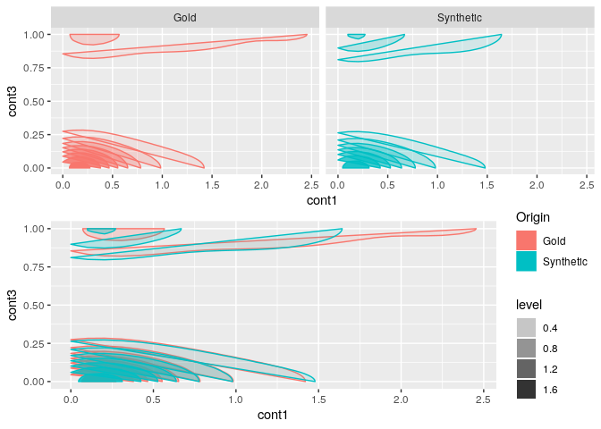

BigSyn
======

Installation
------------

`devtools::install_github("DanielBonnery/BigSyn")`

Package dependencies
--------------------

installed.packages()\["BigSyn","Depends"\] `utilities::getDependencies("BigSyn")`

Demo
----

To run the demo, just run: `demo(Synthesize_database)`

Shiny app to compare Synthetic and original data.
-------------------------------------------------

To run the Shiny app,just run: `runComnpare()`

<!-- -->

<!-- -->

Step by step demo.
------------------

``` r
#Create a simple database with 2 tables: TableA and TableB.
library(BigSyn)
data(tableA);
data(tableB);
uniqueid<-unique(tableA[,1:2])
tableB<-cbind(uniqueid,tableB[1:nrow(uniqueid),])

#Transpose the two tables: one row per unique value of id1a, id1b.

TKtableA<-BigSyn::Generaltransposefunction(tableA,c("id1a","id1b"),c("id2a","id2b"))
TKtableB<-BigSyn::Generaltransposefunction(tableB,c("id1a","id1b"),character(0))


#Merge everything

Ttable<-merge(TKtableA$TtableA,TKtableB$TtableA, by =c("id1a","id1b"))

#Synthesize

STtable<-SDPSYN2(Ttable,asis = c("id1a","id1b"),nrep = 1)

#Separate the Synthetic merged transposed table by table of origin

STtableA<-STtable[[1]][c("id1a","id1b",grep("tableA",names(STtable[[1]]),value = TRUE))]
STtableB<-STtable[[1]][c("id1a","id1b",grep("tableB",names(STtable[[1]]),value = TRUE))]

#Back transpose

TSTtableA<-BigSyn::GeneralReversetransposefunction(TtableA = STtableA,
                                                   key = TKtableA$key)

TSTtableB<-BigSyn::GeneralReversetransposefunction(TtableA = STtableB,
                                                   key = TKtableB$key)

#check the two tables
#runCompare(TSTtableA,TSTtableB)
```

``` r
TSTtableA$Origin="Synthetic"
tableA$Origin="Gold"
X=rbind(tableA,TSTtableA[names(tableA)])
ggplot2::ggplot(X,aes(factor1,fill=Origin)) + geom_bar(position = "dodge")
```


``` r
  library(gridExtra)
      plot1<-ggplot2::ggplot(X,aes(x = cont1,y=cont3,color=Origin,group=Origin))+
        stat_density_2d(geom = "polygon", aes(alpha = ..level.., fill = Origin))
      plot2<-plot1+facet_grid(.~Origin)+theme(legend.position="none")
      grid.arrange(plot2,plot1)
```


